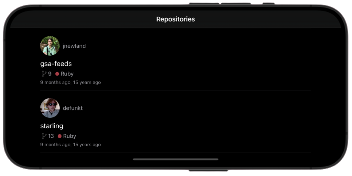
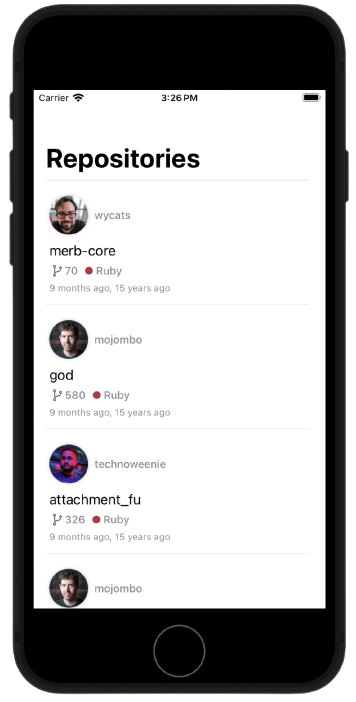

<table>
  <tr>
    <td></td>
    <td><h1>GitGlimpse</h1></td>
  </tr>
</table>

GitGlimpse is a mobile app that allows you to explore public GitHub repositories. It provides essential information about repositories, their owners, and supports both light and dark modes. It even checks for internet connectivity to keep you informed. 

I implemented the bonus feature - pagination using Realm for an API that doesn't support it.

## Features

- View and retrieve public GitHub repositories.
- Display repository name, owner's name, and owner's avatar.
- Show the creation date in a user-friendly format.
- Support light and dark mode for your comfort.
- Check for internet connectivity to keep you informed.

## Implementation Highlights

- Utilized Dispatch Group to handle multiple API requests for different repository details.
- Employed Realm for local data persistence to support pagination.
- Leveraged Alamofire for network requests, Kingfisher for image loading, and Reachability to check for internet connectivity.
- Enhanced the UI to provide an engaging user experience.

## UI

  
  
  

# Responsive UI

  
  

## Credits

- [Alamofire](https://github.com/Alamofire/Alamofire)
- [Realm](https://realm.io/docs/swift/latest/)
- [Kingfisher](https://github.com/onevcat/Kingfisher)
- [Reachability](https://github.com/ashleymills/Reachability)

